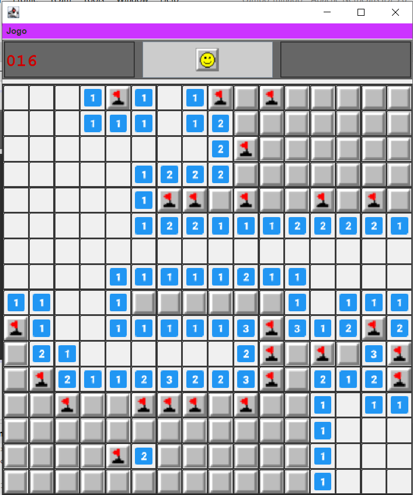

# Campo Minado Java Swing

> Jogo de Campo Minado completo, desenvolvido em **Java Swing** com GUI Builder do NetBeans, gerenciado por **Maven**.

---



---
## 📋 Descrição do Projeto

Este projeto reproduz o clássico **Campo Minado**, oferecendo:

* **Três níveis de dificuldade**:

  * **Fácil**: grade 9×9, 10 minas
  * **Médio**: grade 16×16, 40 minas
  * **Avançado**: grade 30×16, 99 minas
* **Flood-fill automático**: quando uma casa é aberta e não tem minas vizinhas (valor zero), todas as casas adjacentes são também abertas recursivamente.
* **Clique esquerdo** para abrir casas e **clique direito** para marcar/desmarcar bandeiras.
* **Contador visual** de minas restantes, atualizando a cada marcação.
* **Face interativa** no topo que reinicia o jogo e expressa vitória ou derrota.
* **Revelação completa das minas** ao perder ou vencer, mostrando todas as bombas no tabuleiro.
* **Layout responsivo** e redimensionamento de ícones conforme o nível.

---

## 🏁 Pré-requisitos

Antes de rodar o projeto, certifique-se de ter instalado:

* **Java JDK 24.0.1** (ou superior)
* **Apache Maven 3.6+**
* (Opcional) **NetBeans IDE 26** para abrir e editar a interface GUI via GUI Builder

---

## 📦 Estrutura do Projeto

```
campo-minado/
├ pom.xml                        # Configuração do Maven
├ README.md                      # Este documento
└ src/
   ├ main/
   │  ├ java/
   │  │  └ ds131/pedro/campominado/
   │  │     ├ CampoMinadoForm.java  # JFrame Form + lógica
   │  │     ├ CampoMinado.java      # Lógica do tabuleiro
   │  │     ├ Cell.java             # Modelo de célula
   │  │     └ Nivel.java            # Enum de níveis
   │  └ resources/
   │     └ images/                  # Ícones usados
   │        ├ tile.png
   │        ├ mine.png
   │        ├ flag.png
   │        ├ smile.png
   │        ├ sad.png
   │        └ numbers/1.png…8.png
   └ test/                         # (opcional) testes automáticos
```

---

## 🚀 Como Compilar e Executar

### Comandos Maven

1. **Clone** o repositório:

   ```bash
   git clone https://github.com/NeroPRDO/Campo_Minado.git
   cd campo-minado
   ```

2. **Compile** o projeto:

   ```bash
   mvn clean compile
   ```

3. **Execute** a aplicação:

   ```bash
   mvn exec:java
   ```

### Via NetBeans

1. **File → Open Project**, selecione a pasta `campo-minado`.
2. Aguarde o NetBeans recarregar o `pom.xml` e indexar os arquivos.
3. Clique em **Run** (▶) no projeto para compilar e rodar.

> **Dica**: Em **Project Properties → Run → VM Options**, adicione `--enable-preview` se usar recursos de preview do Java.

---

## 🎮 Modo de Jogo e Mecânicas

1. **Início**: ao abrir, o jogo inicia no nível **Fácil** por padrão. O contador de minas (`lblMinesLeft`) mostra `010`.
2. **Abrir células**:

   * **Clique esquerdo**: revela a célula.
   * Se **mina**, perde imediatamente, face fica triste e todas as minas são reveladas.
   * Se **número (1–8)**, mostra ícone correspondente.
   * Se **vizinhas == 0**, revela recursivamente todas as casas conectadas sem minas (**flood-fill**).
3. **Marcar bandeiras**:

   * **Clique direito** em células fechadas: alterna bandeira.
   * O contador de minas decrementa/incrementa conforme as bandeiras são marcadas.
4. **Reiniciar jogo**:

   * Clique na **face** (btnFace) para começar um novo sorteio de minas no nível corrente.
5. **Trocar nível**:

   * No menu **Jogo**, escolha **Fácil**, **Médio** ou **Avançado** para reiniciar no nível selecionado.
6. **Condições de vitória**:

   * Todos os espaços **sem mina** são abertos OU todas as minas são corretamente marcadas.
   * A face fica sorrindo e todas as minas são reveladas.
7. **Condições de derrota**:

   * Uma mina é aberta. Face triste, todas as minas reveladas e jogo desabilitado.

---

## 🔧 Customização Visual

* **Tamanho dos botões**:

  * Fácil/Médio: **32×32px**
  * Avançado: **20×20px** (para caber o grid inteiro)
  * Ajuste em `CampoMinadoForm.resetGame()`, definindo `btnSize`.
* **Cores e bordas**:

  ```java
  b.setBackground(new Color(240,240,240));
  b.setBorder(BorderFactory.createLineBorder(Color.DARK_GRAY, 1, true));
  ```
* **Icons**:

  * Importe PNGs em `src/main/resources/images`.
  * As imagens são carregadas e escalonadas via `loadIcon(path, w, h)`.

---

## 📝 Detalhes de Implementação

* **`Nivel`**: enum com `cols`, `rows` e `minas`.
* **`Cell`**: cada célula guarda `temMina`, `aberto`, `marcado` e `vizinhas`.
* **`CampoMinado`**: sorteia minas e calcula `vizinhas` para cada célula.
* **`CampoMinadoForm`**:

  * Construtor: chama `initComponents()`, carrega ícones e configura listeners.
  * `resetGame()`: recria o `boardPanel` dinamicamente com `GridLayout`.
  * Métodos de interação: `handleOpen()`, `toggleFlag()`, `floodFill()`, `checkWin()`, `gameOver()`.

---

## 🤝 Contribuições

1. Fork este repositório.
2. Crie uma branch (`git checkout -b feature/nome_da_feature`).
3. Commit suas mudanças (`git commit -m "Descrição do que foi feito"`).
4. Push para sua branch (`git push origin feature/nome_da_feature`).
5. Abra um Pull Request explicando suas alterações.

---

"Hear and salute Ulfroegni, for he shows the way."

---

© 2025 Pedro Eduardo — UFPR
